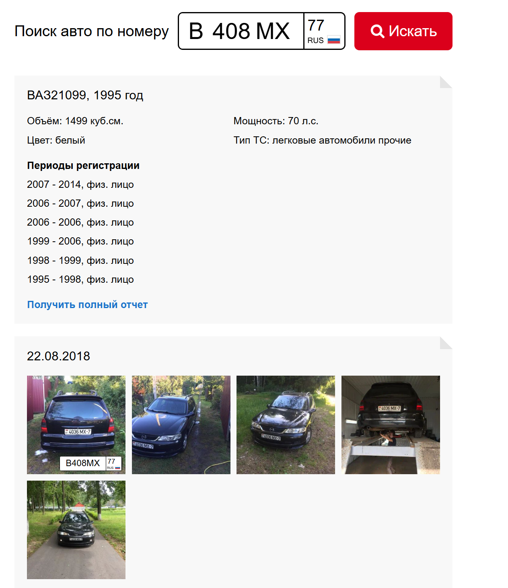
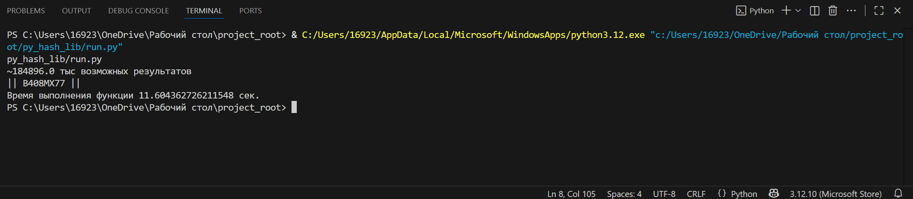

# Решение хеш-задачи

**Ответ:** `B408MX77`

**Цвет объекта:**  
если речь про номера — белый,  
если речь про машину — тоже белый,  
также на сайте [nomerogram.ru](https://www.nomerogram.ru/n/b408mx77-156152b3f/) отображается, что нужная машина — ВАЗ-21099, 1995 г.,  
но также показывается тёмно-синий (Opel Vectra B, фото 2018 г., Республика Беларусь) с номерами на одной картинке (скрины чек).

---

**Фото:**  
  
  


---

`py_hash_lib/run.py`

```python
if __name__ == "__main__":
    target1  = "743f0ed26d2bff34fb9a335588238ceb"
    target2 = "ef581243eb6f7fa74ce03466b9051464275c6b34017a6f031f2548a6d5d0b711"
    solve_problem(target1, target2)
